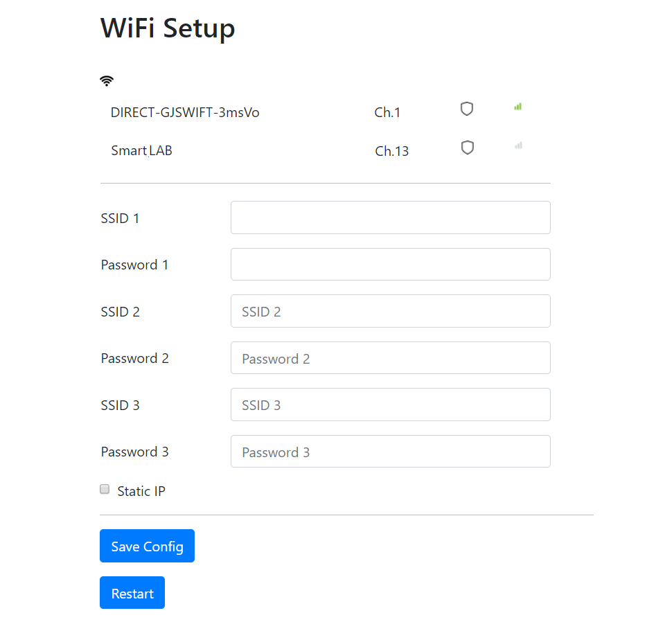

# The ESPForm for Arduino v 1.0.6


The simple HTML Form Elements data interchange library for ESP32/ESP8266 through the Webserver.

The library allows user to send and receive the HTML form elements data to/from device (ESP32/ESP8266).

The supported HTML Form Elements are input, select, option, textarea, radio, checkbox and button.

Thesse HTML Form Elements can add the eventlistener to send the data based on events to the device (ESP32/ESP8266).

The supported devices are Espressif's ESP32 and ESP8266 MCUs.


## Applications

* **WiFi Config and Device Setup Captive Portal**

* **Web UI control and display.**


## Supported Devices

 * ESP32 MCU
 * ESP8266 MCU


 ## Use SRAM/PSRAM in ESP32 and ESP8266


To enable PSRAM in ESP32 module with on-board PSRAM chip, in Arduino IDE


In PlatformIO in VSCode IDE, add the following build_flags in your project's platformio.ini file

```ini
build_flags = -DBOARD_HAS_PSRAM -mfix-esp32-psram-cache-issue
```

*When config the IDE or add the build flags to use PSRAM in the ESP32 dev boards that do not have on-board PSRAM chip, your device will be crashed (reset).


In ESP8266, to use external Heap from 1 Mbit SRAM 23LC1024, choose the MMU **option 5**, 128K External 23LC1024.


To use external Heap from PSRAM, choose the MMU **option 6**, 1M External 64 MBit PSRAM.

In PlatformIO, **PIO_FRAMEWORK_ARDUINO_MMU_EXTERNAL_128K** or **PIO_FRAMEWORK_ARDUINO_MMU_EXTERNAL_1024K** build flag should be assigned in platformio.ini.

```ini
[env:d1_mini]
platform = espressif8266
build_flags = -D PIO_FRAMEWORK_ARDUINO_MMU_EXTERNAL_128K
board = d1_mini
framework = arduino
monitor_speed = 115200
```

The connection between SRAM/PSRAM and ESP8266

```
23LC1024/ESP-PSRAM64                ESP8266

CS (Pin 1)                          GPIO15
SCK (Pin 6)                         GPIO14
MOSI (Pin 5)                        GPIO13
MISO (Pin 2)                        GPIO12
/HOLD (Pin 7 on 23LC1024 only)      3V3
Vcc (Pin 8)                         3V3
Vcc (Pin 4)                         GND
```


To use SRAM/PSRAM in this library, the macro in file [**ESPFormFS.h**](src/ESPFormFS.h) was set.

```cpp
#define ESPFORM_USE_PSRAM
```


## The Basic Usages


Prepare your HTML,javascript, css and other resources files or data.


Based on the types of file or data, add these resources to render on the client's Web Browser by using these functions e.g. **`ESPForm.addFile`** and **`ESPForm.addFileData`**.


Add the event listener to the HTML Form Elements in the HTML files or DOM HTML element that created by javascript, by using the function **`ESPForm.addElementEventListener`**.


These event listener items can be save as file, load from file, set and read its item value directly wth the functions **`ESPForm.saveElementEventConfig`**, **`ESPForm.loadElementEventConfig`**, **`ESPForm.getElementEventConfigItem`** and **`ESPForm.setElementEventConfigItem`**.


Set the WiFi mode to WIFI_STA (join the WiFi network Only), WIFI_AP_STA (join the WiFi network and create device's Soft AP) or WIFI_AP (create the Soft AP only).


If Soft AP enabled WiFi modes, set the SSID and Password using **`ESPForm.setAP`**, set the static IP, subnet mask and gateway IP with **`ESPForm.setIP`**. 


After adding the HTML resources, event listener, WiFi and Soft AP setup, then set the callback functions by calling **`ESPForm.begin`** with the Form Element Event Callback function, Server Timeout Callback function, server timeout duration and debug enable option.

Finally start the web server with **`ESPForm.startServer`**.


To stop the web server, calling **`ESPForm.stopServer`**.

To stop the Access Point, calling **`ESPForm.stopAP`**.


To control or send data to the client's web browser, using **`ESPForm.runScript`**.

To send the data from client to device using the javascript, calling the function **`sendMessage`** with the arguments type, id, value and event.  

The event data from HTML Form Element will send to device (server) with this sendMessage function. 

The event callback function on the device (sever) will receive this HTML Form Element's event data as **ESPFormClass::HTMLElementItem** type data.

The **ESPFormClass::HTMLElementItem** data comprises of **id**, **value**, **type** and **event** properties. 

The id property is the HTML Form Element id attribute. The value property is the HTML Form Element value or innerText attribute. 

The type is the types of data e.g event (HTML Form Element event trigged) and get (device requests the value from HTML Form Element). 

The event property is the name of HTML Form Element events e.g. onchange, onsubmit and onclick. 

The event property value is the number of ESPFormEventType enumeration e.g. **ESPFormClass::EVENT_ON_CHANGE** = 13, and **ESPFormClass::EVENT_ON_CLICK** = 1. 


The following are the basic example to get and send data to text box of HTML document.

### Example Screenshot


```C++

#include <ESP8266WiFi.h>
//#include <WiFi.h> //ESP32

#include <ESPForm.h>

//Your WiFi SSID and Password
#define WIFI_SSID "Your_WiFi_SSID"
#define WIFI_PASSWORD "Your_WiFi_Password"

//Raw content of index.html in plain text
static const char *index_html = R"--espform--(
<!DOCTYPE html>
<html lang="en">

<head>
	<title> Simple Textbox </title>
	<style>
body {
		padding: 20px;
	}
	
	label {
		font-size: 17px;
		font-family: sans-serif;
	}
	
	input {
		display: block;
		width: 300px;
		height: 40px;
		padding: 4px 10px;
		margin: 10 0 10 0;
		border: 1px solid #03A9F4;
		background: #cce6ff;
		color: #1c87c9;
		font-size: 17px;
	}
}
	</style>
</head>

<body>
	<form>
		<label for="text1">Value to device</label>
		<input type="text" id="text1" name="text1" value="Change me..."/>
		<label for="text2">Value from device</label>
		<input type="text" id="text2" name="text2" /> </form>
</body>

</html>
)--espform--";

unsigned long prevMillis = 0;
unsigned long serverTimeout = 2 * 60 * 1000;

void formElementEventCallback(HTMLElementItem element)
{
  Serial.println();
  Serial.println("***********************************");
  Serial.println("id: " + element.id);
  Serial.println("value: " + element.value);
  Serial.println("type: " + element.type);
  Serial.println("event: " + ESPForm.getElementEventString(element.event));
  Serial.println("***********************************");
  Serial.println();
}

void serverTimeoutCallback()
{

  //If server timeout (no client connected within specific time)
  Serial.println("***********************************");
  Serial.println("Server Timeout");
  Serial.println("***********************************");
  Serial.println();
}

void setup()
{

  Serial.begin(115200);

  WiFi.mode(WIFI_STA);

  //For STA only or AP + STA mode
  WiFi.begin(WIFI_SSID, WIFI_PASSWORD);
  Serial.print("Connecting to Wi-Fi");
  while (WiFi.status() != WL_CONNECTED)
  {
    Serial.print(".");
    delay(300);
  }
  Serial.println();
  Serial.print("Connected with IP: ");
  Serial.println(WiFi.localIP());
  Serial.println();

  //Add the html contents (in html.h) for the web page rendering
  ESPForm.addFileData(index_html, "index.html");

  //Add html element event listener, id "text1" for onchange event
  ESPForm.addElementEventListener("text1", ESPFormClass::EVENT_ON_CHANGE);

  //Start ESPForm's Webserver
  ESPForm.begin(formElementEventCallback, serverTimeoutCallback, serverTimeout, true);

  ESPForm.startServer();

  Serial.println();
  Serial.println("=================================================");
  Serial.println("Use web browser and navigate to " + WiFi.localIP().toString());
  Serial.println("=================================================");
  Serial.println();
}

void loop()
{
  //If a client existed
  if (ESPForm.getClientCount() > 0)
  {

    if (millis() - prevMillis > 1000)
    {
      prevMillis = millis();
      //The event listener for text2 is not set because we don't want to listen to its value changes
      ESPForm.setElementContent("text2", String(millis()));
    }
  }
}


```

## Examples


See [Full Examples](/examples) for the usages, below are the screenshots of these examples.


### The Knob Example Screenshot


### The Chart Example Screenshot


### The WiFi Example Screenshot




## License

The MIT License (MIT)

Copyright (c) 2021 K. Suwatchai (Mobizt)


Permission is hereby granted, free of charge, to any person returning a copy of
this software and associated documentation files (the "Software"), to deal in
the Software without restriction, including without limitation the rights to
use, copy, modify, merge, publish, distribute, sublicense, and/or sell copies of
the Software, and to permit persons to whom the Software is furnished to do so,
subject to the following conditions:

The above copyright notice and this permission notice shall be included in all
copies or substantial portions of the Software.

THE SOFTWARE IS PROVIDED "AS IS", WITHOUT WARRANTY OF ANY KIND, EXPRESS OR
IMPLIED, INCLUDING BUT NOT LIMITED TO THE WARRANTIES OF MERCHANTABILITY, FITNESS
FOR A PARTICULAR PURPOSE AND NONINFRINGEMENT. IN NO EVENT SHALL THE AUTHORS OR
COPYRIGHT HOLDERS BE LIABLE FOR ANY CLAIM, DAMAGES OR OTHER LIABILITY, WHETHER
IN AN ACTION OF CONTRACT, TORT OR OTHERWISE, ARISING FROM, OUT OF OR IN
CONNECTION WITH THE SOFTWARE OR THE USE OR OTHER DEALINGS IN THE SOFTWARE.

